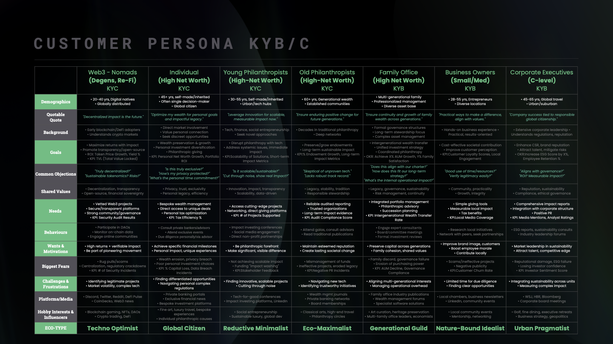

# 🧭 Business Outline: Phase 1

### <mark style="background-color:green;">Mission</mark>

We’re on a mission to ignite a verifiable climate renaissance by transforming global climate action from an abstract concept into a tangible, transparent, and profoundly engaging journey, empowering individuals and organizations to achieve measurable environmental and social impact through the innovative fusion of Web3 and AI.

We enable Climate Clarity for a sustainable future.

***

### <mark style="background-color:green;">1.0 The Ecosystem: A Platform for Planetary Provenance</mark>

Impaction Global delivers a comprehensive, integrated digital platform designed to redefine climate action and philanthropy. Our offerings are meticulously crafted for seamless user experience and verifiable impact, built around synergistic pillars:

* **The Impaction Calculator:** A cutting-edge, privacy-preserving, and Web3-enabled carbon footprint assessment tool for both individuals and organizations. It provides granular CO2 calculations, aligns with specific UN Sustainable Development Goals (SDGs), and offers hyper-personalized, AI-powered sustainability recommendations with advanced bias detection. This consultative approach fosters a sticky user relationship, guiding them toward impactful choices.
* **The Impact Tracker (Personalized Dashboard):** A uniquely comprehensive, personalized user hub designed as the primary driver for repeat activity. It visualizes "Net Impact," tracks progress against AI-generated goals, and offers a detailed history of offset purchases and minted achievements, empowering users with clear, actionable insights into their environmental journey.

ADDITIONAL FEATURES INCLUDE:

* Privacy-First & Enterprise-Grade Architecture: Our platform is built on a Zero-PII design with complete blockchain data segregation, setting a new benchmark for trust and user privacy. It features enterprise-grade security for multi-organization support, including unified authentication, comprehensive audit trails, and real-time threat detection.
* Flexible & Secure Payments: We support both traditional Fiat and multi-cryptocurrency payments (including HBAR), integrated with progressive fraud detection mechanisms to ensure secure and seamless transactions.

### &#x20;<mark style="background-color:green;">1.1 Value Proposition Architecture</mark>

PRIMARY MESSAGE:

Impaction Global transforms the abstract concept of environmental responsibility into tangible, tradable, and socially valuable digital assets. Unlike traditional carbon tracking apps, we create an immutable legacy of climate action through blockchain-verified certificates that serve as both personal achievement tokens and community currency.

SECONDARY MESSAGING:

* **Transparency Revolution:** "See exactly where every.  climate action leads"
* **Community Gamification:** "Compete, collaborate, and  celebrate climate victories together"
* **AI-Powered Personalization:** "Your unique path to  net-zero, powered by intelligent recommendations"
* **Hedera Advantage:** "Lightning-fast, carbon-negative  blockchain technology"
* Competitive Advantage: Building Trust and Driving Action

### &#x20;<mark style="background-color:green;">1.2 Competitive Edge and Integrity</mark>

* AI-Driven Hyper-Personalization: Our unique "Eco-Type" analysis and continuously refined AI recommendations create a highly sticky and valuable user experience, translating complex data into actionable, relevant insights.
* Vertically Integrated Platform: Unlike fragmented solutions, Impaction Global offers a seamless, end-to-end experience from footprint assessment and personalized recommendations to verifiable offsetting and impact tracking, all within a single, cohesive ecosystem.

### &#x20;<mark style="background-color:green;">1.3 Core Market Opportunity and Positioning</mark>

Tapping into a Multi-Billion Dollar Nexus of Impact & Innovation the global imperative for climate action is accelerating, driving unprecedented growth across key sectors.

**The Voluntary Carbon Market:** Valued at an estimated USD 4.04 billion in 2024 (World Bank, 2024)1, is projected to reach USD 50 billion by 2030 (McKinsey, 2021)2, growing at a remarkable CAGR of 35.1%. Concurrently, the Web3 Gaming Market:

Is set to exceed USD 182.98 billion by 2034 (19.24% CAGR) (Yahoo Finance, 2025)3, and the AI in Climate Change Mitigation Market is forecasted to reach USD 80.6 billion by 2034 (17.3% CAGR) (InsightAce Analytic, 2025)4.

Existing climate solutions often suffer from critical fragmentation, a lack of verifiable transparency, and disengaging user experiences. Impaction Global directly addresses these unmet needs by offering a differentiated, verifiable, and deeply engaging platform for:

* **Carbon-Conscious Individuals (Plus Web3 & High-Net-Worth):** Seeking personalized, rewarding, and transparent ways to understand, reduce, and offset their environmental footprint, moving beyond passive concern to active participation.
* **Businesses (SMEs to Global Corporations):** Requiring comprehensive, auditable, and engaging solutions for ESG reporting, verifiable carbon offsetting, and effective employee/stakeholder engagement in sustainability initiatives.
* **NGOs & Climate Project Developers:** Gaining direct, transparent access to funding through our marketplace, alongside verifiable mechanisms for reporting and showcasing their impact projects to a global audience.
* I**mpact Investors:** Discovering high-integrity, liquid, and verifiable opportunities to invest in climate and social impact projects, with clear on-chain proof of outcomes.

### &#x20;<mark style="background-color:green;">1.4 Web3 Digital Market Strategy & Framework</mark>

1\. HEDERA ECOSYSTEM INTEGRATION MARKETING

1.1 HEDERA NETWORK LEVERAGE

* Carbon-Negative Messaging: Emphasize Hedera's carbon-negative consensus mechanism aligning perfectly with climate mission
* Transaction Speed Benefits: Highlight near-instant verification of climate actions versus slow traditional systems
* Low-Cost Accessibility: Market democratized access to climate action through Hedera's minimal transaction fees
* Enterprise Readiness: Target Hedera's existing enterprise partners for B2B adoption opportunities

1.2 CROSS-PROTOCOL COLLABORATIONS

* DeFi Climate Integrations: Partner with Hedera-based DeFi protocols for climate-focused yield farming opportunities
* Hedera dApp Partnerships: Integrate with existing Hedera applications for expanded user acquisition

2\. COMMUNITY-FIRST LAUNCH STRATEGY

2.1 PRE-LAUNCH COMMUNITY BUILDING (MONTHS 1-2)

* Twitter Feed Posts: Connecting climate data scientists, sustainability experts, thought leaders, business organizations, global institutions, and blockchain for good platforms.
* Twitter Spaces Climate Talks: Monthly educational sessions featuring climate scientists, Web3 thought leaders, and sustainability experts
* Linked-In & Medium Thought Leadership: Publish comprehensive articles on climate-tech intersection, Hedera's sustainability advantages, and the future of environmental accountability
* Alpha Tester Program: Recruit climate-conscious early adopters for exclusive beta access and co-creation opportunities

2.2 COMMUNITY GAMIFICATION ELEMENTS

* Ambassador Program: Recruiting influential environmental and Web3 advocates as official ambassadors with special NFT credentials
* Pioneer Badges: NFT rewards for early community participation in carbon reduction.

3\. TOKEN ECONOMICS AND INCENTIVE MARKETING

3.1: NFT/SBT MARKETING CAMPAIGN

* Partnership Airdrops: Collaboration with Carbon Neutral Web3 Companies
* Climate Achievement Certificates:  SBTs for major milestones (first ton of CO2 reduced, etc.)

4\. INFLUENCER AND PARTNERSHIP ECOSYSTEM

4.1: CLIMATE INFLUENCER NETWORK

* Sustainability Creators: Partner with YouTube, TikTok, and Instagram creators focused on environmental content
* Academic Partnerships: Collaborate with climate researchers for credible content and platform validation

5\. AI-DRIVEN CORPORATE FOCUSED MARKETING VIA LINKEDIN

5.1 HYPER-TARGETED CONTENT STRATEGY

* Sustainability Officer marketing: AI-powered recommendation engine for personalized and tailored corporate sustainability challenges

6\. CONTENT MARKETING AND EDUCATION STRATEGY

6.1 POST-LAUNCH COMMUNITY BUILDING (MONTHS 3+)

* Social Media: Instagram and Tik-Tok
* LinkedIn & X/Twitter Spaces: Posts and Talks

7\. PERFORMANCE MARKETING AND GROWTH HACKING

7.1: WEB3-NATIVE ADVERTISING

* DeFi Protocol Partnerships: Sponsored content within popular DeFi platforms reaching environmentally conscious crypto users
* Referral Sign-Up Rewards: Exclusive discounts for recommendations

### &#x20;<mark style="background-color:green;">1.5 Intellectual Property</mark>

INTELLECTUAL PROPERTY

This system linking real-world environmental performance to digital asset benefits represents innovative intersection of environmental compliance and DeFi mechanisms.

TRADE SECRET PROTECTION:

Critical algorithmic components including the AI-powered personalization engine, carbon calculation methodologies(once developed), and bias detection systems act as trade secrets. The specific parameters for discount calculations, token distribution algorithms, and user scoring mechanisms provide competitive advantages best preserved through confidentiality.

STRATEGIC CONSIDERATIONS:

Given the international scope and Web3 nature, patent filing should prioritize jurisdictions with strong climate-tech initiatives and clear blockchain IP frameworks (US, EU, Canada, Singapore). The company will pursue continued applications as the platform evolves, capturing improvements in carbon accounting, verification processes, and tokenization mechanisms.

DEFENSIVE STRATEGY:

Regular IP audits should assess new features, algorithm improvements, and partnership integrations for additional protection opportunities as the platform scales across multiple blockchain ecosystems.

### &#x20;<mark style="background-color:green;">1.6 Launch Roadmap and Milestones</mark>

Our strategic roadmap prioritizes delivering working functionality with incremental security enhancements, ensuring robust and secure deployment:

* **Phase 1  (Launched - Basic MVP):** Beta deployment of the core AI Global Monitor (Digital Twin) with initial WebGL rendering and real-time data feeds. Development of the Impaction Calculator with AI integration for basic personalization. Initial smart contracts for project showcase.
* **Target Metrics:**

\- User registration completion rate > 60%

\- Carbon assessment completion rate > 70%

\- NFT minting success rate > 85%

\- Page load time < 5 seconds.

### &#x20;<mark style="background-color:green;">1.6 Success Metrics and KPIs</mark>

COMMUNITY GROWTH INDICATORS

* Discord/Telegram community size and engagement rates
* Twitter followers and interaction quality
* User-generated content creation and sharing

PLATFORM ADOPTION METRICS

* Monthly active users and retention rates
* Carbon footprint data uploaded and verified
* Climate action NFTs minted and held
* Corporate partnerships and pilot programs launched

FINANCIAL PERFORMANCE

* Revenue from enterprise partnerships
* Community growth and allocation efficiency

### &#x20;<mark style="background-color:green;">1.6 Risk Mitigation and Contingency Planning</mark>

MARKET VOLATILITY MANAGEMENT

* Technology Risk: Diversified blockchain strategy with Hedera as primary but multi-chain compatibility planned

COMMUNITY MANAGEMENT

* Transparent Communication: Regular community updates and decision-making transparency
* Expectation Management: Clear roadmap communication and realistic milestone setting
* Crisis Response: Prepared communication strategies for potential technical or market challenges
* Revenue Model: Diversified Streams for Sustainable Growth

### &#x20;<mark style="background-color:green;">1.6 Revenue Highlights</mark>

Our primary revenue streams are designed for scalability and long-term sustainability:

* **Fees for NFT processing:** Fees for generation of additional AI carbon footprint recommendations
* **Marketplace Fees:** Our fee structure for the calculator is based on a percentage A percentage-based fee on the transaction of liquidity token, tokenized impact assets (NFTs) within the Decentralized Impact Mission Marketplace, ensuring alignment with successful impact generation.
* **Premium Features/Subscriptions:** Tiered access for corporate clients to advanced AI analytics, custom ESG reporting dashboards, dedicated support, and exclusive access to high-demand impact projects.

YEAR 1 - $235,000;

YEAR 2 - $1,890,000;

YEAR 3 - $5,120,000

Our strategy focuses on capturing and retaining users by offering a superior, personalized, and engaging experience that effectively bridges the gap between environmental awareness and meaningful, verifiable climate action.

USER ACQUISITION:

* **Targeted Content Marketing:** Developing educational content on carbon footprint reduction, Web3 for good, and verifiable impact, optimized for SEO and distributed across sustainability, Web3, and tech-focused channels.
* **Community Engagement:** Active participation and thought leadership within Web3 communities (e.g., Discord AMAs, Twitter Spaces), environmental forums, and conscious consumer groups.
* Early Adopter Airdrops

ENGAGEMENT & RETENTION:

* **AI-Powered Personalization:** Continuously refining "Eco-Type" analysis and tailored recommendations to maintain user relevance and drive sustained behavioral change.
* **Community Building:** Cultivating active DAOs/Guilds and social features to create a vibrant ecosystem where users collaborate and support each other's impact journeys.

STRATEGIC PARTNERSHIPS:

* **Climate Project Developers:** Onboarding diverse, high-integrity environmental and social projects globally to enrich the Decentralized Impact Mission Marketplace.

### &#x20;<mark style="background-color:green;">1.7 Team</mark>

(As per the White Paper, the Impaction Global team comprises a multidisciplinary group of innovators and domain experts dedicated to leveraging technology for planetary good, with extensive experience in decentralized systems architecture, advanced AI/ML, climate modeling, environmental impact assessment, and user-centric product design. Supported by a network of advisors in Web3, sustainability, and finance.)

[Nathan Odotei](https://www.linkedin.com/in/nathan-odotei-3b1bb793/) - **Chief Executive Officer & Ai / Web3 Researcher**

[linkedin.com/in/nathan-odotei-3b1bb793/](https://www.linkedin.com/in/nathan-odotei-3b1bb793/)

Nathan is an innovator and seasoned operator with a strong track record of building and scaling startups across multiple industries. His experience ranges from leading CSA and global regulatory compliance in manufacturing, to SaaS electronic medical record integrations, DLT research, and most recently, advancing regenerative finance and public goods in the blockchain sector. In the past Nathan, has held key digital transformation roles at leading firms such as Thomson Reuters, led Strategy at an AI digital marketing start up and is recognized for his deep operational and strategic expertise. Mission driven and impact-focused, he brings collaborative execution and cross-vertical insight to every project.

[Manish Chauhan](https://www.linkedin.com/in/manishkchauhan/) – **Chief Product Officer & Ai / Web3 Researcher**

[linkedin.com/in/manishkchauhan/](https://www.linkedin.com/in/manishkchauhan/)

Manish is a world-class, multidisciplinary designer with over 20 years of experience leading design and technology projects for Fortune 500 companies, and innovation xLab departments, across sectors including the likes of BUPA, GE, and Xbox. Educated in Canada, UK and visiting researcher to UAE and USA, he is highly trained in design, architecture, systems thinking, and human-centered design. Manish specializes in integrated systems consulting and enterprise technology architecture, bringing expertise in both hardware and software to every project. Beyond the typical fields his interest in Sci-Fi, Philosophy, and  Construction. Manish has a renowned ability to design innovative products, frameworks, and MVPs, He is not just a design thinker but a design doer that consistently delivers exceptional user experiences and technical excellence.

[Taylor Neil](http://linkedin.com/in/taylor-neill-b6b70557) - **Lead Cloud Engineer**

[linkedin.com/in/taylor-neill-b6b70557](http://linkedin.com/in/taylor-neill-b6b70557)

Taylor is a seasoned professional with deep expertise in DevOps, Site Reliability Engineering (SRE), FinOps, and Cloud Operations Support. With a strong command of cloud-native tools and modern infrastructure engineering practices, Taylor has consistently delivered scalable, reliable, and cost-efficient solutions tailored to complex business needs of fortune 500 companies such as Warner Music Group. A strategic thinker and collaborative leader, Taylor has built high-performing environments where cross-functional teams thrive. By fostering a culture of innovation and operational excellence, he has spearheaded the architecture of scaling resilient, multi-tenant Saas infrastructure and scaling automation pipelines that not only meet enterprise-grade technical and business requirements but also accelerate digital transformation across the organizations he has worked for with long term Impact.

[Mujtaba Khan](http://linkedin.com/in/mujtaba-khan521) - **Climate/Clean Tech Engineer & Researcher**

[linkedin.com/in/mujtaba-khan521](http://linkedin.com/in/mujtaba-khan521)

Mujtaba brings over 10 years of experience across multiple Fortune 500's and high-growth startups. His background covers finance, software, data analytics, and cybersecurity, with roles at leading firms and innovative ventures, including a top North American energy efficiency/virutal power plant provider and a green AI startup backed by the world’s #1 venture studio. Mujtaba has since transitioned into deep energy research, presenting at energy conferences, and establishing himself as a thought leader at the intersection of sustainability, compute, energy, and web3.

[Alastair Odhiambo](https://www.linkedin.com/in/alastair-odhiambo) - **Lead Backend Engineer**  [l](https://www.linkedin.com/in/alastair-odhiambo)[inkedin.com/in/alastair-odhiambo](https://www.linkedin.com/in/alastair-odhiambo)

Alastair is a software developer and entrepreneur with several years of experience across multiple domains including web development, applied AI, and platform architecture. He excels at translating complex business requirements into technical solutions. His experience includes work at Statera (legaltech securities diligence platform powered by AI), Jam3 (a premier development and UX agency serving clients like YouTube and Sonos), and Sussed (specializing in e-commerce and AI). Alastair has also earned recognition as a League of Innovators Founder and won multiple AI hackathon competitions. His interests include AI research, blockchain technologies, and natural curiosity about industry inner workings.

[Joshua Moore](https://www.linkedin.com/in/joshuamooredev/) - **Frontend Engineer** [linkedin.com/in/joshuamooredev/](https://www.linkedin.com/in/joshuamooredev/)

Joshua is a front-end developer with 2+ years of experience building polished, responsive platforms for early-stage startups. He led full-stack production of 10+ page Web3 investor sites and animated landing pages using React, GSAP, and Three.js. Known for fast execution and visual precision, he brings clean UX, mobile optimization, and startup-level agility to every build. Outside of work, Joshua is expanding his skills in blockchain development and game design, combining technical depth with a strong creative drive.

### &#x20;<mark style="background-color:green;">1.7 References</mark>

1.(**World Bank , 2024**) p. 12 -&#x20;

https://carbonpricingdashboard.worldbank.org

2\. (**McKinsey, 2021**) p. 12

https://www.mckinsey.com/capabilities/sustainability/our-insights/a-blueprint-for-scaling-voluntary-carbon-markets-to-meet-the-climate-challenge

3\. (**Yahoo Finance, 2025**) p. 12

https://finance.yahoo.com/news/web3-gaming-market-size-worth-083700309.html

4.(**InsightAce Analytic, 2025**) p.12

https://www.insightaceanalytic.com/report/-ai-in-climate-change-mitigation-market/3124

***

### Core Marketing Positioning

